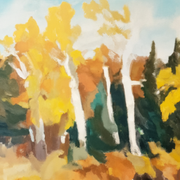

# OpenAI Cmdlet
A simple PowerShell cmdlet for invoking OpenAI API to perfom and text, image and speech-to-text related tasks. 


```powershell
# The following command is equivalent to 
# Invoke-OpenAIText -Prompt "..." -Mode:ChatCompletion -Temperature:1 -Samples:1
igpt @"
> Convert this text to a programmatic command:
>
> Example: Ask Constance if we need some bread
> Output: send-msg `find constance` Do we need some bread?
>
> Reach out to the ski store and figure out if I can get my skis fixed before I leave on Thursday
> "@
```
```
Prompt   : Convert this text to a programmatic command:

           Example: Ask Constance if we need some bread
           Output: send-msg
                            ind constance Do we need some bread?

           Reach out to the ski store and figure out if I can get my skis fixed before I leave on Thursday
Response : {send-msg ind ski-store Can I get my skis fixed before I leave on Thursday?}
```

For API details, please check [OpenAI API Documentation](https://platform.openai.com/docs/introduction/overview)

For more usage examples, please check [OpenAI API Examples](https://platform.openai.com/examples)

## Requirements
- [OpenAI API Key]( https://openai.com/blog/openai-api )
- [PowerShell >= 7.3.3](https://github.com/PowerShell/powershell/releases)

## Getting started
### Install the module from PowerShell Gallery
```powershell
Install-Module OpenAICmdlet
Import-Module OpenAICmdlet
```

### Build the module locally
```powershell
git clone git@github.com:Neroro64/OpenAICmdlet.git
./build.ps1 -OutputPath Artifacts -Configuration Release
Import-Module Artifacts/OpenAICmdlet.dll

# To set the API key
Set-OpenAIAPIKey
> Enter your API key: : ********
"Success! The API key is encrypted and stored in $ENV:OPENAI_API_KEY (default: $PSScriptRoot/OpenAI_API.key)"

# You add this module to your PowerShell profile, to be auto-imported upon start-up
# Linux
Add-Content -Path $Home/.config/powershell/Microsoft.PowerShell_profile.ps1 -Value "Import-Module OpenAICmdlet"
# Windows
Add-Content -Path $Home/Documents/PowerShell/Microsoft.PowerShell_profile.ps1 -Value "Import-Module OpenAICmdlet"
```

## Usage
NOTE: This module only provides basic PowerShell interface to interact with the API. It does not come with a memory solution to automatically store / resume the conversations. 

Use `Get-Help <CommandName> -Full` to learn more about the syntax of the command and see more examples.

### -WhatIf
You can alwasy preview the content of the API request by appending `-WhatIf` flag to the command (ie. dry-run)

```powershell
igpt "Generate prompts for creative ai arts" -WhatIf
```

```
What if: 
Sending a request to https://api.openai.com/v1/chat/completions
with API Key from: <API_KEY_PATH>
estimated cost: 1.4E-05
---
Request body : {
  "model":"gpt-3.5-turbo-0301",
  "messages":[
    {
      "role":"system",
      "content":"You are a helpful assistant"
    },
    {
      "role":"user",
      "content":"Generate prompts for creative ai arts"
    }
  ],
  "temperature":1,
  "top_p":1,
  "max_tokens":200,
  "n":1
}
---
```

### `Invoke-OpenAIText` (Text completion) [Alias='igpt']
A simple PowerShell function for invoking OpenAI's API to perform the text related tasks such as
text/code completion, summarize, explanation etc. (default mode: ChatGPT)

For more details, see https://platform.openai.com/docs/guides/completion

By default, it uses ChatGPT mode (model=`gpt-3.5-turbo-0301`) because it perform similar to `text-davinci-003` on general tasks at 10% of the price.

---
#### **Text Generation**
```powershell
igpt "Generate prompts for creative ai arts"
```
```
Prompt   : Generate prompts for creative ai arts
Response : {1. Create an abstract painting inspired by the colors of a sunset.
           2. Design a futuristic cityscape using geometric shapes and neon colors.
           3. Generate a portrait of a person using only lines and shapes.
           4. Create a landscape painting of a forest in autumn.
           5. Design a surrealistic scene with floating objects and distorted perspectives.
           6. Generate a digital collage of different textures and patterns.
           7. Create a minimalist illustration of a city skyline at night.
           8. Design a pattern inspired by the shapes and colors of a flower garden.
           9. Generate a digital sculpture of an animal using abstract shapes.
           10. Create a mixed media artwork using both traditional and digital techniques.}
```
---
```powershell
igpt -Prompt:"Help me learn dotnet Dependency injection" -Temperature:1 -MaxTokens:500 -Samples:1 -StopSequences:"`n" -OutVariable session
```
>Sure, I can help you with that!
>
>In .NET, Dependency Injection (DI) is a design pattern that helps developers achieve loosely coupled code, which is more maintainable, testable, and extensible. DI allows developers to inject dependencies (such as interface contracts) into their code rather than creating the dependencies themselves.
>
>Here is a basic example of how to use DI in C#:
>
>1. Define the interface contract for the dependency:
>
>```c#
>public interface IMyService
>{
>    void DoSomething();
>}
>```
>... 
---
#### To continue chatting

```powershell
igpt "Show me more complex examples" -ContinueSession $session
```
> Sure, here's a more complex example that involves multiple dependencies and configuration:
> 
> 1. Define the interface contracts for the dependencies:
> 
> ```c#
> public interface IMyService1
> {
>     void DoSomething();
> }
> 
> public interface IMyService2
> {
>     void DoSomethingElse();
> }
> ```
> ...


### `Invoke-OpenAIImage` (Image generation) [Alias='idalle']
A simple PowerShell function for invoking OpenAI's API to perform the image related tasks such as
image generation from text prompt, image edits and image variation. (default mode: Generation)

For more details, see https://platform.openai.com/docs/guides/images/introduction

---

```powershell
idalle "A happy man eating hot dog" | Select Response -First 1 | Start-process
# The response contains an url to the generated image. By pipling this url to Start-Process we can open the link in a browser
```


---

```powershell
# Use one of the prompt that we generated above.
idalle "Create a landscape painting of a forest in autumn." | Select Response -First 1 | Start-process
```


---

```powershell
# Use the generated image as input to generate more variations
idalle -Mode:Variation -ImagePath:"resources/generated_img.png" -ImageSize:"256x256" | Select Response -First 1 | Start-process
```


### `Invoke-OpenAIAudio` (Speech-to-text) [Alias='iwhisper']
A simple PowerShell function for invoking OpenAI's API to perform the speech-to-text related tasks such as
transcription and translation. (default mode: Transcription)

For details, see https://platform.openai.com/docs/guides/speech-to-text

---

```powershell
iwhisper -Mode:Transcription -AudioPath:"resources/f7879738_nohash_0.wav" -AudioLanguage:en
```

```
Prompt   :
Response : {down,}
`
